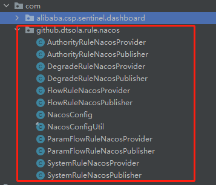

## 概述
Sentinel与Nacos集成实现，实现控制台修改规则（流控规则、熔断规则、热点规则、系统规则、授权规则）并存储Nacos。

## 代码说明
### 核心代码包
com.github.dtsola.rule.nacos
* 如图：
  

### 修改点相应包
com.alibaba.csp.sentinel.dashboard.controller

### 配置生成规则
应用名称+环境标识+规则类型+.json
* 如图：

## 使用
### 界面

### 控制台服务端
[官方控制台使用说明](./Sentinel_Dashboard_README.md)

* 注意点
    - 打包后文件名为：devops-sentinel-dashboard.jar
    - ☆ 建议nacos创建的 命名空间名 和 命名空间名ID 为一致的（比如都为 dev）
    - 额外配置参数：(需要配置)
      - spring.cloud.nacos.server-addr 指定nacos地址（默认值：localhost:8848）
      - spring.profiles.active 指定环境（默认值：dev）
      - spring.cloud.nacos.discovery.namespace（默认值：同spring.profiles.active当前值）
      - spring.cloud.nacos.config.namespace（默认值：同spring.profiles.active当前值）

### 微服务客户端
#### 项目引入
```xml
<dependency>
    <groupId>com.alibaba.cloud</groupId>
    <artifactId>spring-cloud-starter-alibaba-sentinel</artifactId>
</dependency>

<dependency>
    <groupId>com.alibaba.csp</groupId>
    <artifactId>sentinel-datasource-nacos</artifactId>
</dependency>
```
#### bootstrap.properties配置
```properties
spring.profiles.active=dev
spring.cloud.nacos.server-addr=localhost:8848
spring.cloud.nacos.config.server-addr=${spring.cloud.nacos.server-addr}
spring.cloud.nacos.discovery.server-addr=${spring.cloud.nacos.server-addr}
spring.cloud.nacos.discovery.namespace=${spring.profiles.active}
spring.cloud.nacos.config.namespace=${spring.profiles.active}

# Sentinel config
spring.cloud.sentinel.transport.dashboard=localhost:8075

spring.cloud.sentinel.datasource.flow.nacos.server-addr=${spring.cloud.nacos.config.server-addr}
spring.cloud.sentinel.datasource.flow.nacos.group-id=SENTINEL_GROUP
spring.cloud.sentinel.datasource.flow.nacos.namespace=${spring.profiles.active}
spring.cloud.sentinel.datasource.flow.nacos.data-id=${spring.application.name}-${spring.profiles.active}-flow-rules.json
spring.cloud.sentinel.datasource.flow.nacos.rule-type=flow

spring.cloud.sentinel.datasource.degrade.nacos.server-addr=${spring.cloud.nacos.config.server-addr}
spring.cloud.sentinel.datasource.degrade.nacos.group-id=SENTINEL_GROUP
spring.cloud.sentinel.datasource.degrade.nacos.namespace=${spring.profiles.active}
spring.cloud.sentinel.datasource.degrade.nacos.data-id=${spring.application.name}-${spring.profiles.active}-degrade-rules.json
spring.cloud.sentinel.datasource.degrade.nacos.rule-type=degrade

spring.cloud.sentinel.datasource.param.nacos.server-addr=${spring.cloud.nacos.config.server-addr}
spring.cloud.sentinel.datasource.param.nacos.group-id=SENTINEL_GROUP
spring.cloud.sentinel.datasource.param.nacos.namespace=${spring.profiles.active}
spring.cloud.sentinel.datasource.param.nacos.data-id=${spring.application.name}-${spring.profiles.active}-param-rules.json
spring.cloud.sentinel.datasource.param.nacos.rule-type=param-flow

spring.cloud.sentinel.datasource.system.nacos.server-addr=${spring.cloud.nacos.config.server-addr}
spring.cloud.sentinel.datasource.system.nacos.group-id=SENTINEL_GROUP
spring.cloud.sentinel.datasource.system.nacos.namespace=${spring.profiles.active}
spring.cloud.sentinel.datasource.system.nacos.data-id=${spring.application.name}-${spring.profiles.active}-system-rules.json
spring.cloud.sentinel.datasource.system.nacos.rule-type=system

spring.cloud.sentinel.datasource.authority.nacos.server-addr=${spring.cloud.nacos.config.server-addr}
spring.cloud.sentinel.datasource.authority.nacos.group-id=SENTINEL_GROUP
spring.cloud.sentinel.datasource.authority.nacos.namespace=${spring.profiles.active}
spring.cloud.sentinel.datasource.authority.nacos.data-id=${spring.application.name}-${spring.profiles.active}-authority-rules.json
spring.cloud.sentinel.datasource.authority.nacos.rule-type=authority

```
### 测试
#### Sentinel控制台 添加一条流控规则


#### Nacos中生成的响应文件以及内容


#### Postman调用测试


## 联系我
- E-Mail：dtsola@163.com
- QQ：550182738
